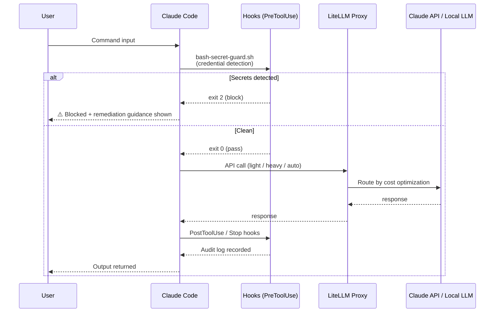

# AI Infrastructure Portfolio

> **"Don't trust AI blindly — prove it with verifiable mechanisms."**

This repository is the infrastructure layer for operating AI in a world where
autonomous agents act on your behalf — designed so that trust is **earned through
cryptographic proof and audit trails**, not assumed.

**Period**: March – May 2026 | Personal project &nbsp;·&nbsp; [日本語版](README_ja.md)

---

## Quick Start

```bash
git clone https://github.com/tiktax/ai-infra-portfolio
cd ai-infra-portfolio
./demo.sh        # verify security hooks are working (no setup required)
```

Expected output:
```
🔍 AI Harness Security Hook Demo
=================================

--- Commands that SHOULD be blocked ---
  ✅ BLOCKED  cat .env
  ✅ BLOCKED  grep password .env
  ✅ BLOCKED  echo $SECRET_TOKEN
  ...

--- Commands that SHOULD pass ---
  ✅ PASSED   wc -l .env (metadata only)
  ✅ PASSED   git status
  ...

Results: 16 passed, 0 failed
✅ All tests passed. Hook is working correctly.
```

---

## Why This Exists

When AI agents act autonomously, organizations face questions they cannot answer:

| Question | Status quo | This project's answer |
|----------|-----------|----------------------|
| **Who's responsible when AI makes a mistake?** | Unclear | Defined in accountability register + audit logs |
| **How do you trust AI output?** | Trust the black box | Verify via SHA-256 hash chains + ECDSA signatures |
| **Was the AI's log tampered with?** | Assumed trustworthy | Technically detectable — every approval entry is hashed |
| **Can you trace "why that decision"?** | Unknown | MCP server makes governance data queryable |

The answer is not better AI models — it's **verifiable infrastructure**.
This project proves trust through cryptographic mechanisms, not promises.

---

## Architecture



Full diagrams (5-layer stack, ITSM cycle): [`docs/architecture.md`](docs/architecture.md)

---

## Trustless Design Principles

1. **Trust the mechanism, not the person** — Behavioral specs, access controls, and audit trails enforce policy automatically, without relying on individual discipline.

2. **Technical trust supplements human trust** — ECDSA signatures, hash chains, and append-only logs provide tamper evidence that human review alone cannot.

3. **Define accountability explicitly** — AI's responsibility (technical quality) and human responsibility (final judgment) are documented in the accountability register, not left implicit.

4. **Non-repudiation by design** — Every gate approval is signed and hashed. Every role assignment is logged. Every policy change is committed to git with author and rationale.

5. **Long-term verifiability over short-term convenience** — Logs are designed to be auditable months or years later, not just in the moment.

---

## Governance Framework

A lightweight operational governance model aligned with **ISO/IEC 20000** (IT Service Management) and **ISO/IEC 27001** (Information Security Management) was adopted throughout — not as formal certification, but as a design discipline.

| Standard | Coverage in this project |
|----------|--------------------------|
| **ISO/IEC 20000** | Incident → Problem → Change cycle; continual improvement; service continuity |
| **ISO/IEC 27001** | Credential control (A.9); audit logging (A.12); security incident management (A.16); risk-based policy |
| **ITIL 5** | AI Governance (6C Capability Model); Product/Service Lifecycle (8 Activities); Change Enablement |

### Full Traceability & Audit Readiness

All governance artifacts are dual-tracked across **GitHub** and **Obsidian**, enabling complete traceability and monthly audit support:

| Layer | Tool | What is recorded |
|-------|------|-----------------|
| **Decision log** | GitHub Issues | Every incident (INC), problem (P), improvement proposal (CIP), and change (C) — immutable, timestamped |
| **Change history** | GitHub (git log) | All policy and config changes with author, date, and rationale in commit messages |
| **Knowledge base** | Obsidian (LLM-Wiki) | RCA findings, architectural decisions, lessons learned — searchable and cross-linked |
| **Audit trail** | GitHub Issues + git | Full INC→CIP→C traceability; monthly review against open incidents and SLO metrics |

**Risk assessment & scoring**: Each incident and improvement proposal is scored in Obsidian using a likelihood × impact matrix. Scores drive CIP prioritization and feed into the monthly audit review.

| Score | Likelihood | Impact | Action |
|-------|-----------|--------|--------|
| P0 (Critical) | High | High | Immediate remediation, block further work |
| P1 (High) | High or High | Medium or High | CIP within current cycle |
| P2 (Medium) | Medium | Medium | Scheduled CIP |
| P3 (Low) | Low | Any | Backlog |

**Monthly audit cycle**: Each month, open incidents, CIP status, SLO measurements, and risk scores are reviewed against the governance baseline — producing a closed-loop record suitable for internal audit or compliance review.

---

## Problems Solved

### 1. Security Governance
*Aligned with ISO/IEC 27001: A.9 Access Control, A.12 Operations Security, A.16 Incident Management*

**Problem**: Credential leak via AI tool output discovered in production (INC-011, INC-012)

**What I built**:
- 9 guardrail hooks (`PreToolUse` / `PostToolUse`) that intercept and block risky commands before execution
- AI behavioral policy document (ISO/IEC 27001-aligned), version-controlled in Git
- 1Password CLI integration — eliminated plaintext secrets from all config files
- gitleaks CI (GitHub Actions) scanning every push and pull request

**Result**: Zero recurrence after initial remediation

---

### 2. Cost Management & ROI

**Problem**: AI inference costs growing without visibility or control

**What I built**:
- Local LLM (Gemma4) / Cloud LLM (Claude API) auto-routing based on task complexity
- Optimized Claude Code CLI subprocess invocation

**Results**:

| Metric | Before | After | Reduction |
|--------|--------|-------|-----------|
| CLI call cost | $0.21/call | $0.001/call | **−99.5%** |
| SessionStart context size | 19 MB | 36 KB | **−99.8%** |
| Est. annual token usage | 33.2B tokens | 13.3M tokens | **−99.96%** |

> Calculation basis: [`docs/achievements.md`](docs/achievements.md)

---

### 3. Incident Management & Continuous Improvement
*Aligned with ISO/IEC 20000: Incident Management, Problem Management, Change Management, Continual Improvement*

**Problem**: AI system failures and policy violations were handled reactively with no permanent fixes

**What I built**:
- Full INC → Problem → CIP → Change cycle (ISO/IEC 20000-aligned)
- 13 incidents tracked from discovery through root cause analysis to permanent resolution
- SLO monitoring for context size and MCP connector count

**Result**: 6 permanent resolutions (CIP-001–006), improvement cycle now automated

---

### 4. Operations Automation
*Aligned with ISO/IEC 20000: Service Operation, Continual Service Improvement*

**Problem**: Repetitive tasks (information gathering, KPI reporting, procedure tracking) done manually

**What I built**:
- 3 scheduled agents (daily digest, weekly KPI review, weekly procedure tracking)
- API integration pipeline: Notion / GitHub / Telegram
- **LLM-Wiki**: implemented Karpathy's LLM-Wiki concept — an AI-maintained knowledge base that feeds back into the agent's context, introducing a PDCA cycle into knowledge management (Plan: index new learnings → Do: auto-sync to Obsidian → Check: surface relevant docs at session start → Act: refine via CIP)

---

### 5. Observability & Knowledge Management
*Aligned with ISO/IEC 27001: A.12 Operations Security; ISO/IEC 20000: Service Reporting*

**Problem**: AI session logs and incident records scattered across tools — hard to search or audit

**What I built**:
- 3-tier memory architecture (short-term session / mid-term project / long-term Obsidian)
- Daily log digest automation — 93% reduction in log file size
- Claude API usage monitoring tool (hard limit detection)

---

## Skills Demonstrated

| Domain | Evidence |
|--------|----------|
| **Security policy design** | 9 hooks, gitleaks CI, 1Password integration, zero-incident record |
| **ISO/IEC 27001 alignment** | Credential control, audit logging, incident response, risk-based policy |
| **ISO/IEC 20000 alignment** | INC→Problem→Change cycle, SLO monitoring, continual improvement |
| **Cost control & ROI analysis** | 99.5% cost reduction; documented calculation basis |
| **System integration** | Notion / GitHub / Telegram APIs; local + cloud LLM routing |
| **Observability** | SLO monitoring, 3-tier memory, log rotation automation |
| **Documentation & governance** | AI usage policy draft, version-controlled behavioral spec |
| **Automation** | 3 scheduled agents, CI/CD pipeline, shell hook system |
| **ITIL 5 AI Governance** | 8-activity lifecycle management; 6C capability model; EU AI Act / JP / US jurisdiction compliance |

---

## Accountability Framework

This project explicitly defines where AI responsibility ends and human responsibility begins.

### AI's Responsibility (Technical Scope)
- Quality of generated/executed output
- Model bugs and inference errors
- Training data limitations

### Human's Responsibility (Final Authority)
- Decision to adopt or reject AI proposals
- Business application of AI output
- Governance policy and oversight
- Accountability for incidents

### Scenario Breakdown

| Scenario | AI's Responsibility | Human's Responsibility |
|----------|--------------------|-----------------------|
| AI generates incorrect data | Generation quality (technical) | Adoption decision + verification |
| AI system is compromised | System vulnerability | Security configuration |
| AI executes autonomously | Technical execution of action | Permission settings + scope control |
| AI produces inappropriate output | Output quality | Monitoring + filtering |

> See [`tools/itil5-ai-governance/accountability-register.md`](tools/itil5-ai-governance/accountability-register.md) for the full register with risk levels and approval flows.

---

## Platform Portability

The implementation uses Claude Code — but the **governance framework is platform-agnostic**.

The three layers have different portability:

```
Governance layer   INC→CIP cycle, ISO alignment, risk scoring, audit trail
(tool-agnostic) →  Works with any AI platform. No changes needed.

Policy layer       Role-based rules, acceptable use policy, CLAUDE.md
(adaptable)    →   Concept is universal; format changes per platform.

Implementation     PreToolUse/PostToolUse hooks, CLAUDE.md, MCP server
(platform-specific)→ Needs reimplementation per platform.
```

### Equivalent controls on other platforms

| Platform | Hook equivalent | Behavioral spec equivalent |
|----------|----------------|---------------------------|
| **Cursor** | `.cursorrules` + VS Code extension | `.cursorrules` |
| **GitHub Copilot** | IDE extension + org policy | Organization-level policy |
| **OpenAI API** | API middleware (Lambda / proxy) | System prompt |
| **Amazon Bedrock** | AWS Lambda Guardrails | System prompt |
| **Microsoft 365 Copilot** | Purview DLP + Conditional Access | Admin center policy |
| **On-premise LLM** | Custom middleware | Any format |

The design principles — defense in depth, fail-safe defaults, audit-first, role-based control — apply regardless of which AI platform an organization adopts.

---

## 2-Month Timeline

```
March                     April                          May
│                         │                              │
▼                         ▼                              ▼
Proved the concept.       Two problems hit at once:      Fixes alone don't
Notion/Telegram/GitHub    cost ($0.21/call) and a        prevent recurrence.
integrations running —    credential leak in prod.       Built governance:
and discovered AI tools   Solved both from scratch:      INC→CIP cycle,
leak secrets if           9 hooks + 99.96% token cut.   6 permanent fixes,
left unconstrained.       Not patched — engineered.     loop now automated.
```

---

## Docs & Examples

| File | Contents |
|------|----------|
| [`docs/achievements.md`](docs/achievements.md) | Quantified results with calculation basis |
| [`docs/architecture.md`](docs/architecture.md) | System diagrams (Mermaid: hook flow, 5-layer stack, ITSM cycle) |
| [`docs/ai-usage-policy-draft.md`](docs/ai-usage-policy-draft.md) | AI usage policy draft (ISO/IEC 27001-aligned) |
| [`examples/hooks/`](examples/hooks/) | 4 security hook implementations (runnable) |
| [`examples/incidents/`](examples/incidents/) | Redacted incident records showing INC→RCA→CIP flow |
| [`tests/hooks/`](tests/hooks/) | Regression test suite for security hooks |
| [`demo.sh`](demo.sh) | One-command demo — verify hooks are working |
| [`docs/deployment-playbook.md`](docs/deployment-playbook.md) | Step-by-step guide for deploying to a team of 10+ |
| [`tools/roi-calculator/`](tools/roi-calculator/) | Interactive ROI calculator — estimate savings at org scale |
| [`tools/claude-config-manager/`](tools/claude-config-manager/) | Multi-user CLAUDE.md manager — role-based config distribution with audit trail |
| [`tools/governance-mcp/`](tools/governance-mcp/) | MCP server — query hooks, role config, incidents, and SLO metrics from within Claude Code |
| [`tools/itil5-ai-governance/`](tools/itil5-ai-governance/) | ITIL 5 AI Governance Compliance Tool — 8-activity lifecycle, 6C capability model, multi-jurisdiction approval (JP/US/EU) |
| [`docs/considerations/`](docs/considerations/) | Deployment gap analysis by scale (startup → large enterprise) + regulated industries |
| [`docs/roadmap.md`](docs/roadmap.md) | Project roadmap — all items complete |

---

## Tech Stack

| Technology | Version | Role |
|------------|---------|------|
| **Claude Code** | Latest | AI agent runtime |
| **Claude API** | Latest | Cloud LLM inference |
| **Gemma4** | Latest | Local LLM via LiteLLM Proxy |
| **gitleaks** | Latest | Secret scanning in CI |
| **1Password CLI** | Latest | Credential management |
| **bash hooks** | — | PreToolUse / PostToolUse enforcement |
| **GitHub API** | REST v3 | Incident and governance tracking |
| **Notion API** | Latest | Knowledge base integration |
| **Telegram Bot API** | Latest | Notification pipeline |
| **cron / GitHub Actions** | — | Scheduled automation |
| **Obsidian / GitHub Issues** | — | Knowledge and audit trail |
| **Python** | 3.10+ | ECDSA signing, audit reports (`tools/trustless_audit/`) |
| **cryptography** | 41.0+ | NIST P-256 signatures (FIPS 186-5) |
| **AWS S3** | Object Lock | WORM storage — Phase 5 roadmap |
| **Docker** | Latest | Containerization — Phase 5 roadmap |

---

## Known Limitations

This project is designed with an honest assessment of its current boundaries:

| Limitation | Current state | Roadmap |
|-----------|--------------|---------|
| **Single key management** | 1Password CLI dependency | Phase 5: Multi-signature scheme |
| **Post-quantum cryptography** | NIST P-256 / ECDSA | Phase 5: Migration to CRYSTALS-Dilithium (NIST FIPS 204) |
| **Timestamp trust** | Server clock dependent | Phase 5: RFC 3161 compliant TSP |
| **AI output signing (C2PA)** | Planned only | Phase 5: Sign AI output artifacts |
| **WORM storage** | Append-only log files | Phase 5: AWS S3 Object Lock (7-year immutability) |

> Honesty about limitations is part of the trustless design philosophy — a system that claims no weaknesses is itself untrustworthy.

---

## Contact

Open to roles in AI infrastructure and enterprise AI governance.

[](https://www.linkedin.com/in/takeshi-koide-3337193b/)
