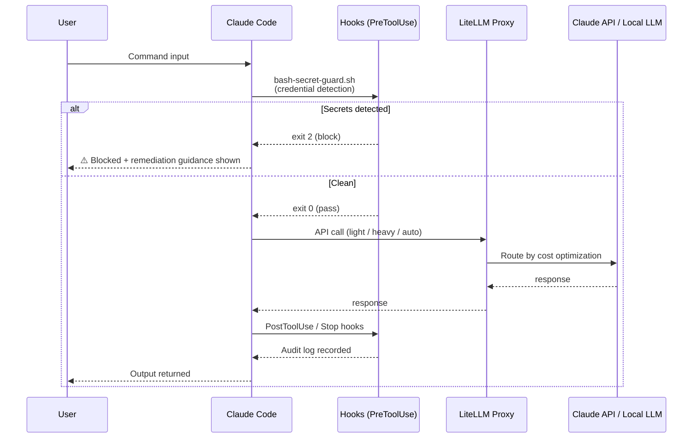
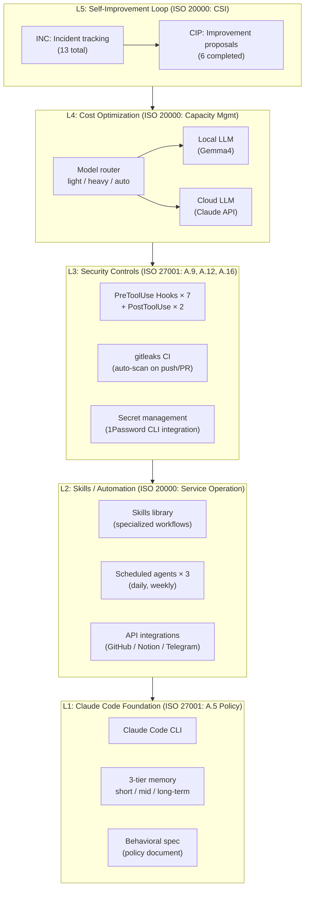
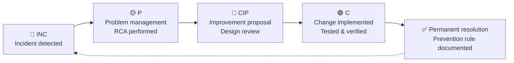
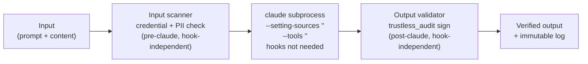

# System Architecture

**Claude Code AI Harness Infrastructure — Overview**
**Governance**: Lightweight alignment with ISO/IEC 20000 (ITSM) and ISO/IEC 27001 (Information Security)

---

## Diagram 1: Hook Event Flow (Security Guardrails)
*ISO/IEC 27001: A.12 Operations Security, A.9 Access Control*

---

## Diagram 2: 5-Layer Stack (Overall Structure)

---

## Diagram 3: Incident → Improvement Cycle
*ISO/IEC 20000: Incident Management, Problem Management, Change Management, Continual Service Improvement*
*ISO/IEC 27001: A.16 Information Security Incident Management*

**Results**: INC-001–013 (13 incidents) → CIP-001–006 (6 permanently resolved)

---

## Diagram 4: Zero-Trust Security for Automation (P-004 Target State)

*INC-015 finding*: `--setting-sources "" --tools ""` bypasses all Claude Code hooks.
This is not a bug — it is the structural consequence of relying on hook-based perimeter security.

**Perimeter model (current)**: Security lives inside Claude Code's hook lifecycle.
Subprocess automation that skips the lifecycle exits the perimeter entirely.

**Zero-trust model (P-004 target)**: Security operates at the content layer,
independent of any Claude Code flags. The subprocess call is treated as an
untrusted primitive — validated externally before and after.

**Zero-trust status per control:**

| Control | Claude Code flag dependency | Status |
|---------|---------------------------|--------|
| `pre-commit-secrets.sh` + gitleaks CI | None — git / CI layer | ✅ Zero-trust |
| `trustless_audit` ECDSA signing + hash chain | None — separate process | ✅ Zero-trust |
| `bash-secret-guard.sh` | Bypassed by `--setting-sources ""` | ⚠️ P-004 |
| `pii-guard.sh` | Bypassed by `--setting-sources ""` | ⚠️ P-004 |
| `mcp-config-guard.sh` | Bypassed by `--setting-sources ""` | ⚠️ P-004 |

**P-004 roadmap**: Extract credential/PII scanning into a subprocess wrapper that validates
input and output independent of Claude Code's hook lifecycle —
making `--setting-sources ""` cost optimization safe by design, not by trust.

---

## Design Principles

> **Note on "L" labels**: This document uses L1–L5 for architecture stack layers.
> [`docs/token-optimization-layers.md`](token-optimization-layers.md) uses L1–L8 for
> optimization technique layers. These are independent numbering schemes.

| Principle | Implementation | Standard |
|-----------|---------------|----------|
| **Defense in Depth** | Multi-layer controls: policy → hook → CI (L1–L3) | ISO/IEC 27001 |
| **Fail-Safe Default** | Hooks block by default; explicit allowlist required to pass | ISO/IEC 27001: A.9 |
| **Observability First** | All hook outputs logged; SLOs monitored continuously | ISO/IEC 27001: A.12; ISO/IEC 20000 |
| **Cost Consciousness** | All API calls routed optimally; cost tracked per call | ISO/IEC 20000: Capacity Mgmt |
| **Continuous Improvement** | INC → CIP cycle converts failures into organizational knowledge | ISO/IEC 20000: CSI |
| **Risk-Based Policy** | Rules derived from actual incidents, not hypothetical threats | ISO/IEC 27001: Risk assessment |
| **Zero-Trust Automation** | Security at content layer, independent of Claude Code flags | P-004 target state |

---

---

## 日本語版

**Claude Code AIハーネス基盤 — 全体構成図**
**ガバナンス**: ISO/IEC 20000（ITSM）およびISO/IEC 27001（情報セキュリティ）の軽量版準拠

---

### 図1: Hookイベントフロー（セキュリティガードレール）
*ISO/IEC 27001: A.12 運用のセキュリティ、A.9 アクセス制御*

図の内容は上記英語版Diagram 1を参照。日本語での補足説明:

ユーザーのコマンド入力に対し、Claude CodeはPreToolUse hookで秘密情報漏洩パターンを自動検査する。検出時はexitコード2でブロックし代替手段を提示。通過したコマンドはLiteLLM Proxyでモデルルーティングされ、PostToolUseでの監査ログ記録まで一貫した制御フローを実現する。

---

### 図2: 5層スタック（全体構造）

| レイヤー | 内容 | ISO準拠 |
|---------|------|---------|
| **L5: 自己改善ループ** | INC→CIPフロー（13件管理・6件解消）| ISO/IEC 20000: 継続的改善 |
| **L4: コスト最適化** | モデルルーター（light/heavy/auto）| ISO/IEC 20000: キャパシティ管理 |
| **L3: セキュリティ統制** | PreToolUse Hook×7・PostToolUse×2・gitleaks CI・1Password統合 | ISO/IEC 27001: A.9/A.12/A.16 |
| **L2: Skills/自動化** | Skillsライブラリ・Scheduledエージェント×3・API統合 | ISO/IEC 20000: サービス運用 |
| **L1: Claude Code基盤** | Claude Code CLI・3層メモリ・行動規範（ポリシー文書）| ISO/IEC 27001: A.5 ポリシー |

---

### 図3: インシデント→改善サイクル
*ISO/IEC 20000: インシデント管理・問題管理・変更管理・継続的サービス改善*
*ISO/IEC 27001: A.16 情報セキュリティインシデント管理*

図の内容は上記英語版Diagram 3を参照。

**実績**: INC-001〜013（13件）→ CIP-001〜006（6件恒久解消）

---

### 設計原則

| 原則 | 実装 | 根拠規格 |
|-----|------|---------|
| **Defense in Depth** | 多層防御: policy → hook → CI（L1〜L3）| ISO/IEC 27001 |
| **Fail-Safe Default** | hookはblockをデフォルト・明示的allowlistで許可 | ISO/IEC 27001: A.9 |
| **Observability First** | 全hookの出力をログ記録・SLOをモニタリング | ISO/IEC 27001: A.12; ISO/IEC 20000 |
| **Cost Consciousness** | 全APIコールをルーターで最適分配・コスト可視化 | ISO/IEC 20000: キャパシティ管理 |
| **Continuous Improvement** | INC→CIPサイクルで障害を組織知識に変換 | ISO/IEC 20000: 継続的改善 |
| **Risk-Based Policy** | 実際のインシデントから導出したルール | ISO/IEC 27001: リスクアセスメント |
