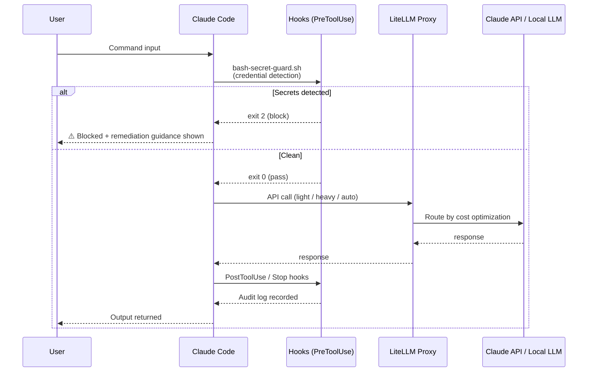
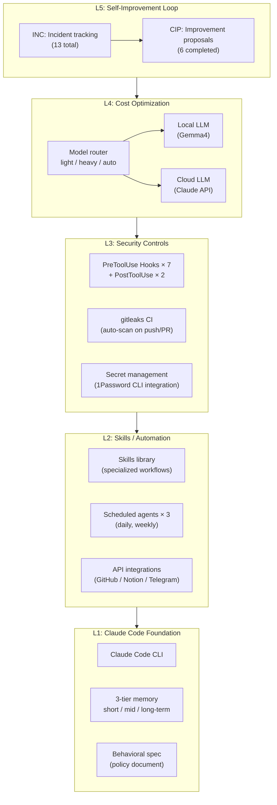
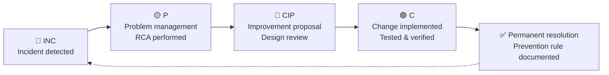

# System Architecture

**Claude Code AI Harness Infrastructure — Overview**

---

## Diagram 1: Hook Event Flow (Security Guardrails)

---

## Diagram 2: 5-Layer Stack (Overall Structure)

---

## Diagram 3: Incident → Improvement Cycle (ITSM Flow)

**Results**: INC-001–013 (13 incidents) → CIP-001–006 (6 permanently resolved)

---

## Design Principles

| Principle | Implementation |
|-----------|---------------|
| **Defense in Depth** | Multi-layer controls: policy → hook → CI (L1–L3) |
| **Fail-Safe Default** | Hooks block by default; explicit allowlist required to pass |
| **Observability First** | All hook outputs logged; SLOs monitored continuously |
| **Cost Consciousness** | All API calls routed optimally; cost tracked per call |
| **Continuous Improvement** | INC → CIP cycle converts failures into organizational knowledge |
