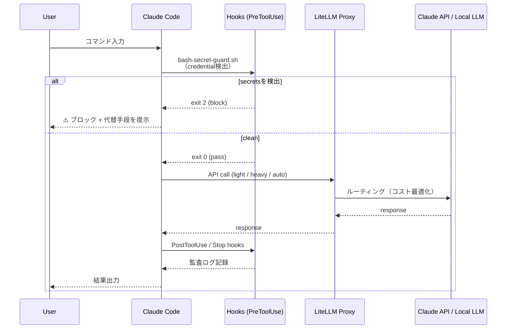
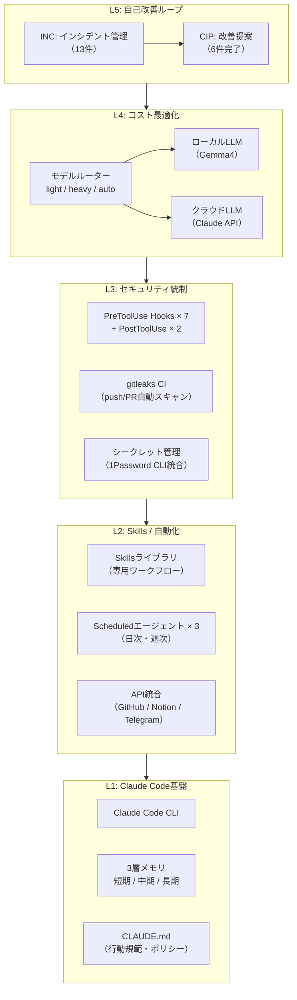
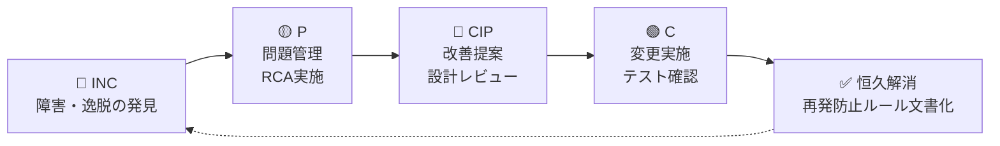

# システムアーキテクチャ

**Claude Code AIハーネス基盤 — 全体構成図**

---

## 図1: Hookイベントフロー（セキュリティガードレール）

---

## 図2: 5層スタック（全体構造）

---

## 図3: インシデント→改善サイクル（ITSMフロー）

**実績**: INC-001〜013（13件）→ CIP-001〜006（6件恒久解消）

---

## 設計原則

| 原則 | 実装 |
|-----|------|
| **Defense in Depth** | L1〜L3の多層防御（policy → hook → CI） |
| **Fail-Safe Default** | hookはblockをデフォルト、明示的allowlistで許可 |
| **Observability First** | 全hookの出力をログ記録、SLOをモニタリング |
| **Cost Consciousness** | 全APIコールをルーターで最適分配、コスト可視化 |
| **Continuous Improvement** | INC→CIPサイクルで障害を組織知識に変換 |
