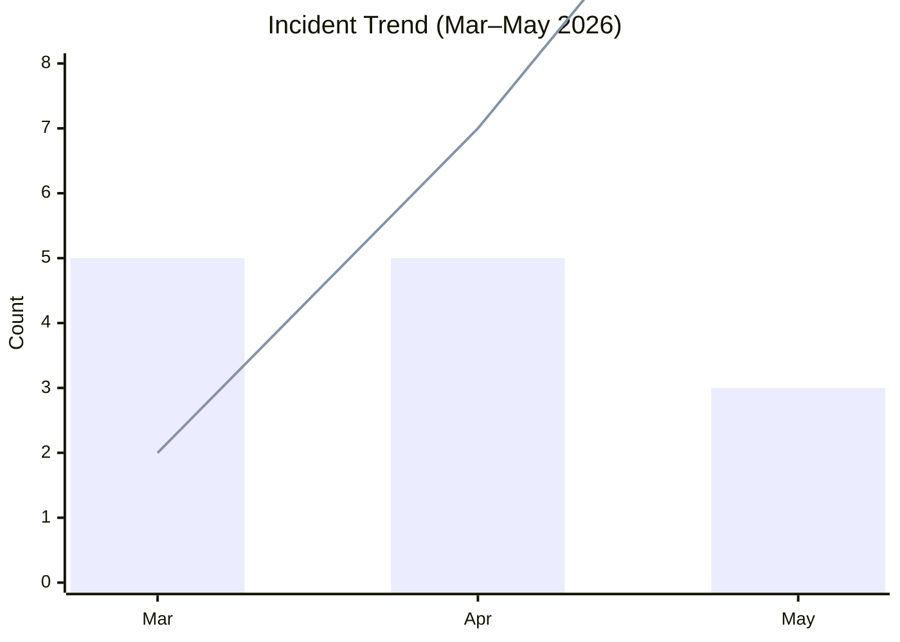
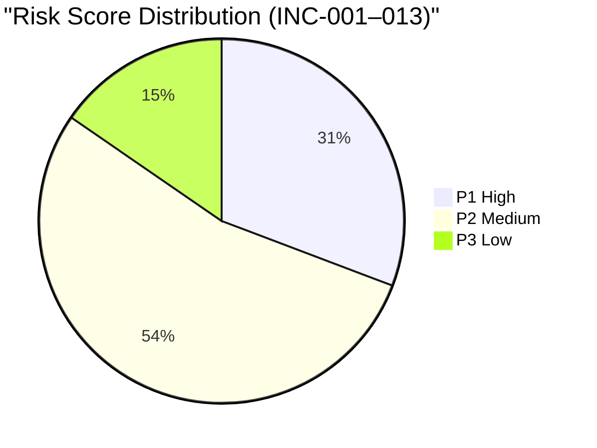
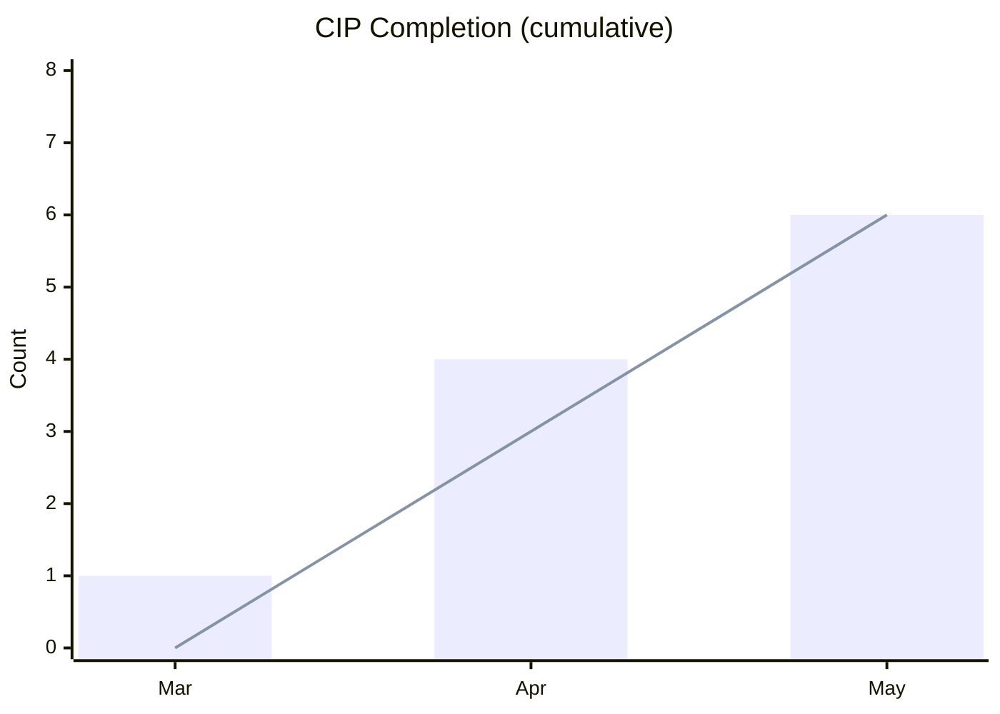
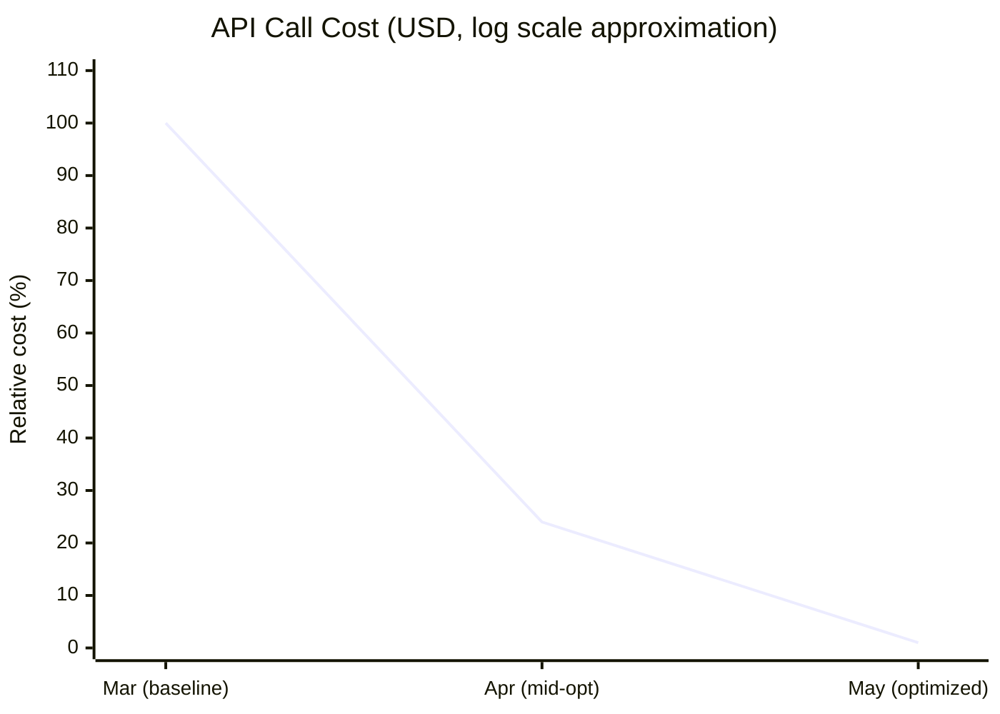
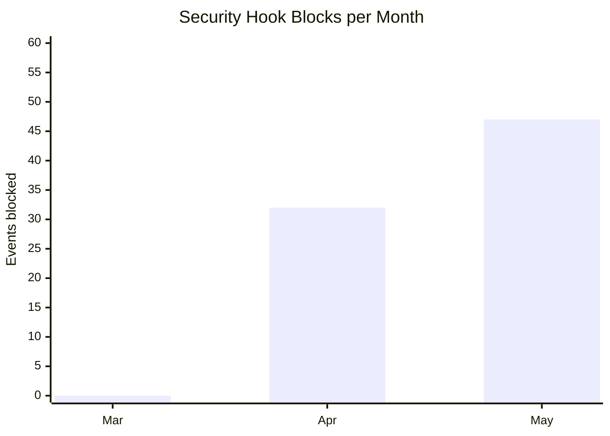

# Operational Dashboard

**Period**: March – May 2026 | Updated: May 2026 (delayed disclosure — closed incidents only)

---

## Security & Incident Management

### ① Incident Trend
*Bar: new incidents per month / Line: resolved incidents (cumulative)*



### ② Mean Time to Resolution (MTTR)
*Average days from incident detection to permanent resolution*

```mermaid
xychart-beta
    title "MTTR Trend (days)"
    x-axis ["Mar", "Apr", "May"]
    y-axis "Days" 0 --> 10
    line [7, 4, 2]
```

---

## Risk & Improvement

### ③ Risk Score Distribution (cumulative total)
*All 13 incidents classified by severity*



### ⑥ CIP Completion Rate (cumulative)
*Bar: proposals raised / Line: permanently resolved*



---

## Cost & Efficiency

### ④ AI Inference Cost Reduction
*Cost per API call over time*



> Actual values: $0.21 → $0.05 → $0.001/call (−99.5% total)

### ⑤ Guardrail Hook Blocks
*Number of risky commands intercepted per month*



> March: hooks not yet implemented. April onwards: 9 hooks active.

---

## Summary Table

| Metric | Mar | Apr | May | Trend |
|--------|-----|-----|-----|-------|
| New incidents | 5 | 5 | 3 | ↓ Improving |
| MTTR (days) | 7.0 | 4.0 | 2.0 | ↓ Improving |
| API cost/call | $0.21 | $0.05 | $0.001 | ↓ −99.5% |
| Hook blocks | 0 | 32 | 47 | ↑ Active |
| CIP resolved | 0 | 3 | 6 | ↑ Progressing |
| SLO status | 🔴 | 🟡 | 🟢 | ↑ Green |
