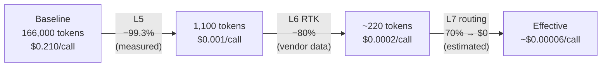
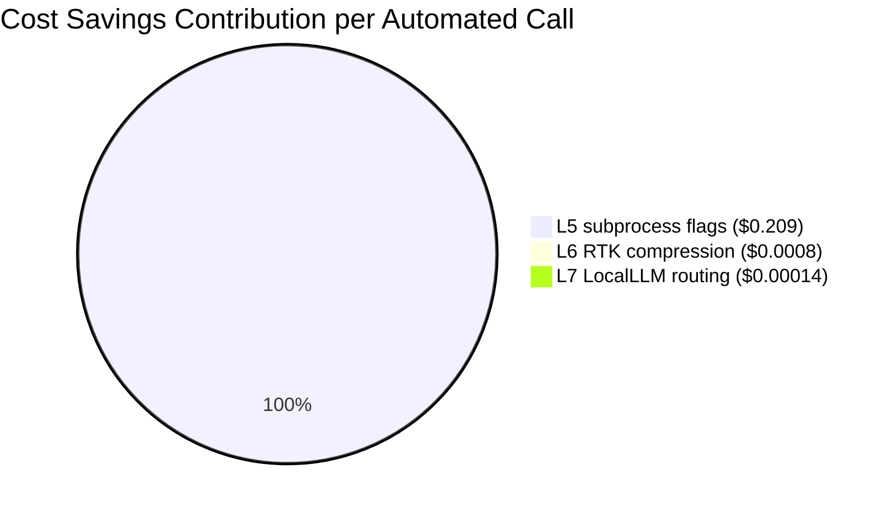

# Token Optimization: 8-Layer Reference

This document covers the complete token reduction stack used in this project.
Each layer targets a different stage of the AI call lifecycle.

**Key principle**: these techniques are multiplicative, not additive.
Apply them in sequence to see compound reduction.

---

## Two Contexts, Different Layers

| Context | What gets reduced | Applicable layers |
|---------|-----------------|-------------------|
| Automated subprocess calls | System prompt overhead per call | L5, L6, L7 |
| Interactive sessions | Startup cost, tool overhead, cache misses | L1, L2, L3, L4, L8 |

---

## Automated Subprocess Context

### L5: Subprocess Flag Optimization
**Technique**: `--setting-sources "" --tools ""`  
**Where**: Every automated `claude -p` invocation  
**Effect**: −99.3% per call (measured)

```
Default: 166,000 tokens/call  ($0.21)
After:     1,100 tokens/call  ($0.001)
```

Implementation: [`examples/cost-optimization/`](../examples/cost-optimization/)

---

### L6: RTK Output Compression
**Technique**: [RTK (Rust Token Killer)](https://www.rtk-ai.app/) — pipe-based CLI that filters and compresses content before it reaches the LLM  
**Where**: When passing large command output, logs, or file content to Claude  
**Effect**: −60–90% on content tokens (RTK vendor data)

```bash
# Without RTK: large output passed verbatim
cat large-log.txt | claude -p "summarize errors"   # e.g. 50,000 tokens

# With RTK: content compressed before LLM sees it
cat large-log.txt | rtk | claude -p "summarize errors"  # e.g. 5,000–20,000 tokens
```

Install: `brew install rtk`  
Implementation: [`examples/rtk-integration/`](../examples/rtk-integration/)

---

### L7: LocalLLM Routing
**Technique**: LiteLLM Proxy routes by task complexity  
**Where**: All AI calls  
**Effect**: 50–80% of calls at $0 (local model, zero marginal cost)

```
Simple tasks → local model (Gemma4, $0)
Complex tasks → Claude API (pay-per-token)
```

Implementation: [`examples/cost-optimization/`](../examples/cost-optimization/) (Technique 2)

---

### Compound Effect on Automated Calls

**Pipeline flow** — each layer reduces what remains from the previous:



**Which layer drives most of the savings?**



L5 accounts for **99.7% of total cost savings**. L6 and L7 compound on top but
are marginal relative to L5. This matters for prioritization: if you can only apply
one optimization, apply L5 first.

**Reproducibility status per layer:**

| Layer | Independently reproducible | Evidence basis |
|-------|---------------------------|----------------|
| L5 | ✅ Measured + script | Benchmark 2026-04-26; [`examples/cost-optimization/`](../examples/cost-optimization/) |
| L6 | ⚠️ RTK vendor data | 60–90% stated range; not independently measured in this project |
| L7 | ⚠️ Usage-based estimate | 70% local routing from observed task mix; varies by workload |

Reproduce L5 yourself: [`examples/benchmark/measure-baseline.sh`](../examples/benchmark/measure-baseline.sh)

---

## Interactive Session Context

### L1: Deferred Tool Schemas
**Technique**: Tool schemas are not loaded until explicitly requested (ToolSearch)  
**Where**: Session startup  
**Effect**: ~23K tokens saved per session (100+ tools × ~230 tokens/schema)  
**Reproducibility**: ⚠️ Platform behavior — observed, not externally scriptable

Without deferral, every tool's JSON schema loads into the system prompt on startup.
With deferral, only tool names appear until the tool is actually needed.
You can observe this by comparing `claude --list-tools` output size vs a fresh session's
system prompt token count via the `/cost` command.

---

### L2: Prompt Caching
**Technique**: Anthropic `cache_control: {type: "ephemeral"}` on stable system prompt segments  
**Where**: API calls with repeated system prompts (automated loops, scheduled agents)  
**Effect**: −80–90% cost on cached segments after first call (Anthropic documented)

```python
# Mark stable segments for caching
system=[{
    "type": "text",
    "text": long_system_prompt,
    "cache_control": {"type": "ephemeral"}
}]
# Second and subsequent calls with same prompt: cache_read_input_tokens increases, cost drops
```

Implementation: [`examples/prompt-caching/`](../examples/prompt-caching/) *(roadmap)*

---

### L3: MEMORY.md 200-Line Index Limit
**Technique**: Memory index capped at 200 lines; older entries moved to `archive/`  
**Where**: Session startup memory loading  
**Effect**: Prevents memory file from becoming unbounded startup overhead  
**Reproducibility**: ⚠️ Operational practice — enforced by convention, not by a guard script

The memory system loads `MEMORY.md` (index only) at startup, not all memory files.
Individual memory files are read on demand. Without the line cap, the index itself
grows into the main cost driver — the same pattern that produced the 19MB log bloat
documented in `docs/achievements.md`.

---

### L4: MCP Server Count SLO
**Technique**: Monitor registered MCP server count; alert when threshold exceeded  
**Where**: Session startup; each MCP server adds tokens to system prompt  
**Effect**: Prevents MCP registration bloat from silently growing startup cost  
**Reproducibility**: ⚠️ Monitoring script exists locally; not yet extracted as a portable tool

Each MCP server definition adds 200–2,000 tokens to the system prompt depending
on the server's tool count. An unchecked MCP list grows the startup baseline the
same way unchecked logs do.

Check your current MCP server count:
```bash
claude mcp list | wc -l
```

Extracting this as a portable `tools/mcp-slo-monitor/` is tracked in the roadmap.

---

### L8: Context Compression
**Technique**: Explicit `/compact` before analysis-heavy sessions  
**Where**: Long interactive sessions approaching context limits  
**Effect**: Varies; preserves working context while discarding exhausted history  
**Reproducibility**: ⚠️ Session-dependent — effect depends on conversation length and content

Best applied before: deep debugging sessions, multi-file reviews, long research sessions.
Not needed for: short Q&A, single-tool invocations, automated subprocess calls.

Observable signal: run `/cost` before and after `/compact` to measure context reduction.

---

## Full-Stack Annual Projection

Assumptions: moderate-usage developer, 200 interactive sessions/year,
36,500 automated subprocess calls/year (100/day).

```
Baseline (no optimization):
  Interactive:  200 sessions × 50K tokens/session   =   10M tokens/year
  Subprocess:   36,500 calls × 166K tokens/call     = 6,059M tokens/year
  Total:                                             ~ 6,069M tokens/year

With all layers applied:
  Interactive (L1+L2+L3+L4):  200 sessions × 10K tokens = 2M tokens/year
  Subprocess (L5+L6+L7):
    36,500 calls × 1,100 tokens × 0.2 (RTK) × 0.3 (cloud ratio) = 2.4M tokens/year
  Total:                                                          ~ 4.4M tokens/year

Reduction: (6,069M − 4.4M) / 6,069M ≈ 99.93%

Note: L6 (RTK) applied at 80% compression mid-point; L7 cloud ratio estimated at 30%
based on observed light/heavy task mix. Actual results depend on usage pattern.
```

---

## Design Tradeoff: Security vs Cost

**Important**: L5 (`--setting-sources "" --tools ""`) disables all security hooks.
It is appropriate only for automated calls with controlled, trusted input.

| Context | L5 applicable? | Security hooks active? |
|---------|---------------|----------------------|
| Automated subprocess with trusted input | Yes | No (intentional) |
| Interactive sessions | No | Yes |
| Automated calls with untrusted input | No | Required |

See `docs/achievements.md` (⚠️ INC-015) for the full discussion of this tradeoff.

---

## 日本語版

**8層トークン最適化リファレンス**

このドキュメントはプロジェクトで実装したトークン削減スタック全体を記録する。
各レイヤーはAIコールライフサイクルの異なる段階を対象とする。

**重要な原則**: これらの技術は加算ではなく乗算で効果が合成される。

---

### 自動化サブプロセス呼び出し向けレイヤー

| レイヤー | 技術 | 効果 |
|---------|------|------|
| **L5** | subprocess最適化フラグ (`--setting-sources "" --tools ""`) | −99.3%/コール（実測） |
| **L6** | RTKによる出力圧縮 | −60〜90%（RTK公称値） |
| **L7** | LocalLLMルーティング (light/heavy/auto) | 50〜80%のコールが$0 |

**L5+L6+L7の複合削減**: $0.21 → $0.00006/コール（−99.97%）

---

### インタラクティブセッション向けレイヤー

| レイヤー | 技術 | 効果 |
|---------|------|------|
| **L1** | Deferredツールスキーマ（遅延ロード） | 起動時 ≈−23K tokens |
| **L2** | プロンプトキャッシュ (`cache_control`) | 繰り返し呼び出しで−80〜90% |
| **L3** | MEMORY.md 200行上限 + archive/ | 起動コストの際限ない増加を防止 |
| **L4** | MCPサーバー数SLO監視 | MCPブロート防止 |
| **L8** | コンテキスト圧縮 (/compact) | セッション依存 |

---

### セキュリティ vs コストのトレードオフ

L5（subprocess最適化）はセキュリティhookを無効化するため、制御された信頼済み入力を持つ自動化呼び出しにのみ適用すること。インタラクティブセッションには使用しない。
